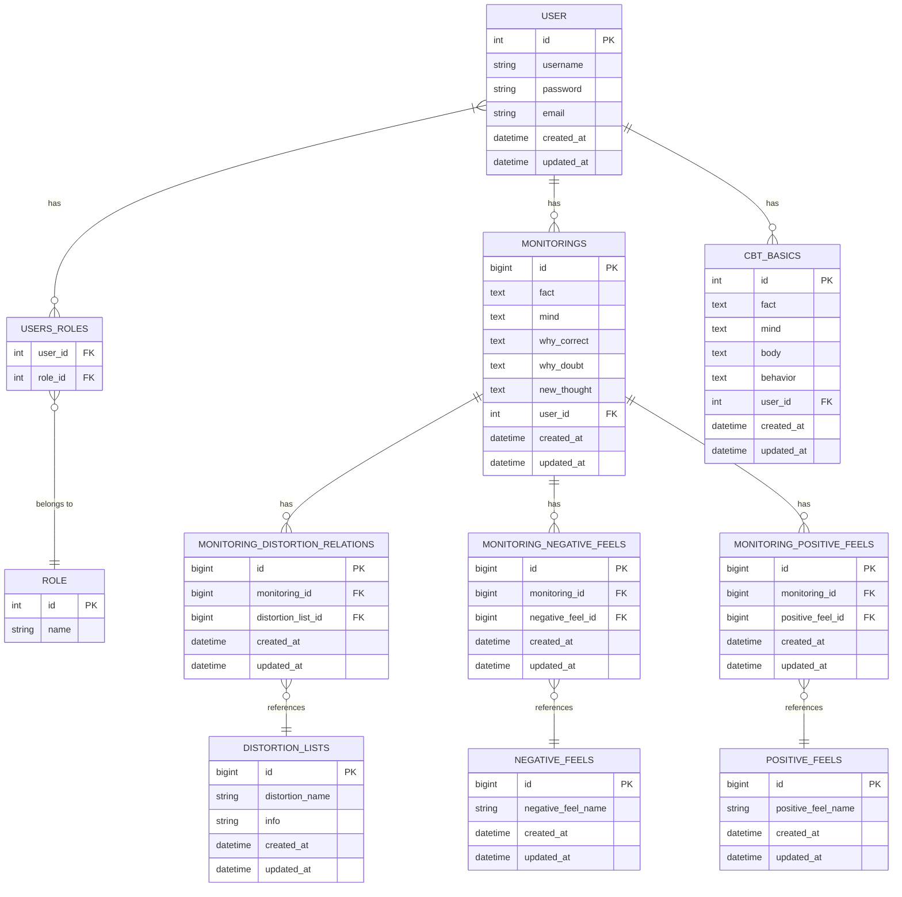

# メンタルヘルスアプリケーションER図

## テーブル説明

### ユーザー認証関連
- **USER**: アプリケーションのユーザー情報を格納
- **ROLE**: ユーザーロール（EMPLOYEE, MANAGER, ADMIN）を格納
- **USERS_ROLES**: ユーザーとロールの多対多関係を管理する中間テーブル

### 思考モニタリング関連
- **MONITORINGS**: ユーザーの思考モニタリング記録を格納
- **DISTORTION_LISTS**: 認知の歪みの種類とその説明を格納
- **MONITORING_DISTORTION_RELATIONS**: モニタリングと認知の歪みの関連を管理する中間テーブル
- **NEGATIVE_FEELS**: ネガティブな感情の種類を格納
- **POSITIVE_FEELS**: ポジティブな感情の種類を格納
- **MONITORING_NEGATIVE_FEELS**: モニタリングとネガティブな感情の関連を管理する中間テーブル
- **MONITORING_POSITIVE_FEELS**: モニタリングとポジティブな感情の関連を管理する中間テーブル

### CBT（認知行動療法）関連
- **CBT_BASICS**: CBTの基本情報を格納

## 関連性
- ユーザーは複数のモニタリング、CBT基本情報を持つことができる
- ユーザーは複数のロールを持つことができる
- モニタリングは複数の認知の歪み、ネガティブな感情、ポジティブな感情と関連付けることができる